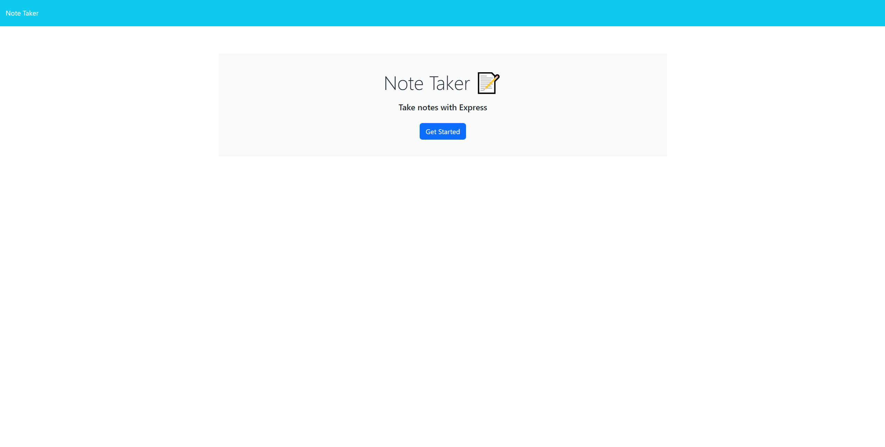
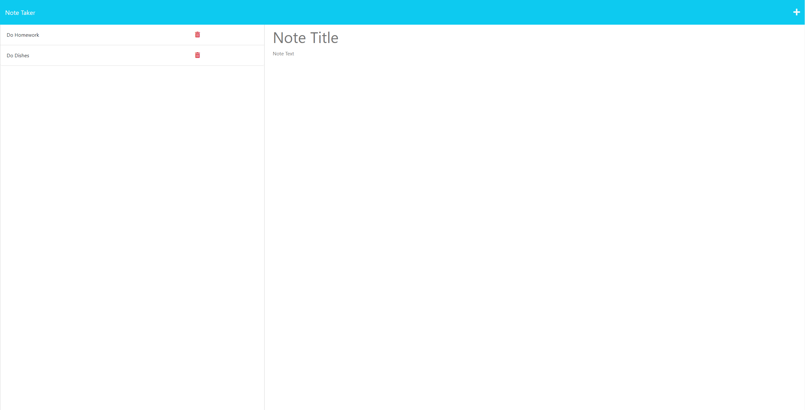

# Note Taker App

## Description

This web application will allow a user to make notes for tasks that they have.

This application allows the user to input a note title, and a text description that will describe the task.

## Installation

There is no installation necessary. 

## Usage

To use this application, you will need to enter the URL [https://mighty-sierra-93576.herokuapp.com/](https://mighty-sierra-93576.herokuapp.com/) into your browser
    
From the homepage, click the "Get Started" button. Any old notes will load, and you will have the ability to enter and save new notes. 

## Credits

This application uses the following 3rd party applications:

 - Express.js
 - heroku
 - uuid

## License

This application does not contain a license.

